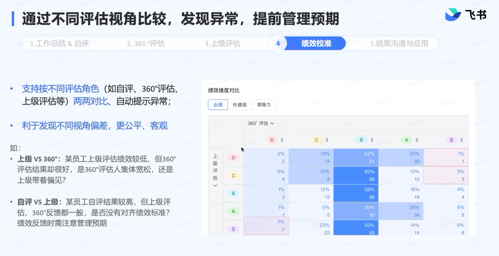

# \[参考\]飞书绩效 \- 视频内容

# 绩效评估过程

## 绩效管理评审流程

## Leader指定\&智能推荐360°评估人

- Leader和HRBP 直接指定

- 根据「组织架构」、「项目合作」和「OKR对齐」推荐

## 工作总结\&自评

- 左边：员工自己的OKR、复盘（月报）、日志（周报）

- 右边：员工填写工作总结

## 360°评估

- 左边：被评估人的：自评总结内容、OKR

- 右边：填写360°评估内容：业绩、价值观、领导力

## 上级评估

- 左边：被评估人的：

  - 工作总结

  - ORK

  - 自评

  - 360°评估

  - HRBP备注

  - 更多参考：历史绩效、任职信息

- 右边：填写上级评估内容：业绩、价值观、领导力

## 绩效校准

## 结果沟通

